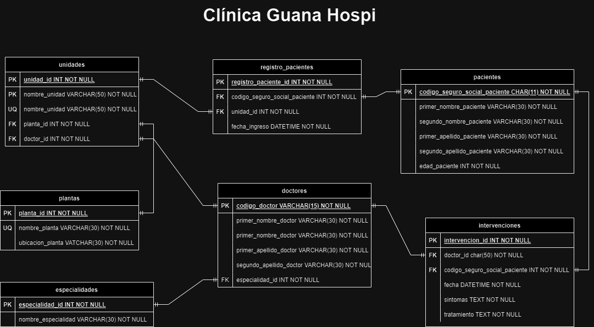

<!--
La Dirección General de la Clínica Privada GuanaHospi, ha decidido recientemente que la empresa
debe mejorar en el registro de las actividades que se realizan, con el fin de poder analizar la actividad
en más detalle. En razón de ello, desea mantener una base de datos con el historial de todos los
pacientes que tiene ingresados en su clínica.

La clínica está divida en varias unidades, cada una de las cuales tiene un identificador, su nombre y
la planta en la que se encuentra. La unidad tiene un único doctor responsable, del cual se desea
almacenar su código, el nombre y su especialidad. Cuando llega un paciente, se le ingresa en una
unidad y se registra su número del Seguro Social, nombre, edad y fecha de ingreso. Durante toda su
estancia en la clínica, se anotan todas las intervenciones que realizan cada uno de los doctores,
indicando la fecha, el síntoma observado y el tratamiento prescrito.

 -->

# Clinica GuanaHospi

## Listado de entidades

### unidades **(ED/EP)**

- unidad_id **(PK)**
- nombre_unidad **(UQ)**
- planta_id **(FK)**
- doctor_id **(FK)**

### doctores **(ED/EC)**

- doctor_codigo **(PK)**
- primer_nombre_doctor
- segundo_nombre_doctor
- primer_apellido_doctor
- segundo_apellido_doctor
- especialidad_id **(FK)**

### plantas **(EC)**

- planta_id **(PK)**
- nombre_planta **(UQ)**
- ubicacion_planta

### especialidades **(EC)**

- especialidad_id **(PK)**
- nombre_especialidad **(UQ)**

### pacientes **(ED)**

- codigo_seguro_social_paciente **(PK)**
- primer_nombre_paciente
- segundo_nombre_paciente
- primer_apellido_paciente
- segundo_apellido_paciente
- edad_paciente

### registro_pacientes **(ED/EP)**

- registro_paciente_id **(PK)**
- codigo_seguro_social_paciente **(FK)**
- unidad_id **(FK)**
- fecha_ingreso

### intervenciones **(ED/EP)**

- intervencion_id **(PK)**
- doctor_id **(FK)**
- codigo_seguro_social_paciente **(FK)**
- fecha
- sintomas
- tratamiento

## Diagrama

### Modelo relacional

## Relaciones

1. Una **planta** pertenece a una **unidad** (_1 a 1_)
1. Un **doctor** pertenece a una **unidad** (_1 a 1_)
1. Un **doctor** tiene una **especialidad** (_1 a 1_)
1. Un **registro_pacientes** tiene un **paciente** (_1 a 1_)
1. Un **registro_pacientes** tiene una **unidad** (_1 a 1_)
1. Una **intervencion** tiene un **doctor** (_1 a 1_)
1. Una **intervencion** tiene un **paciente** (_1 a 1_)

## Reglas de negocio
